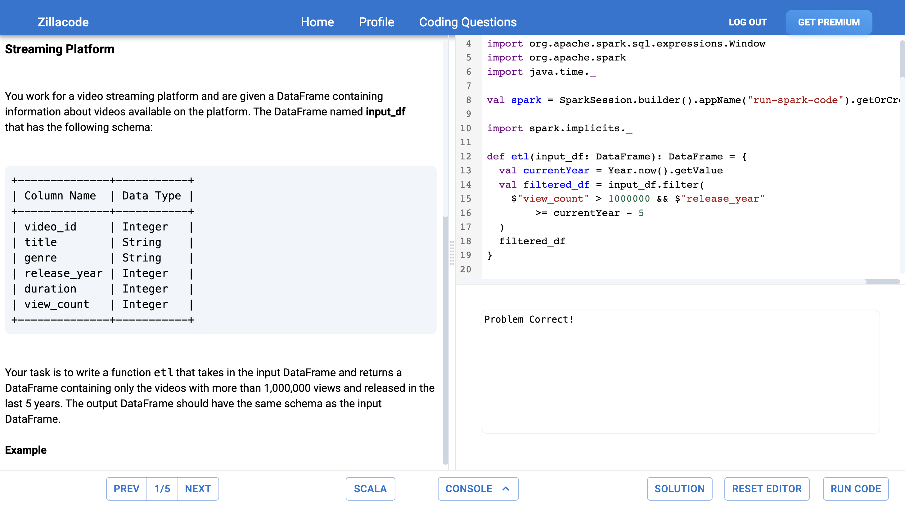
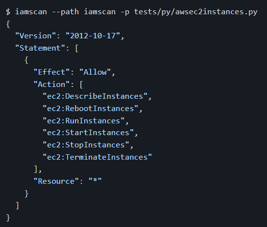
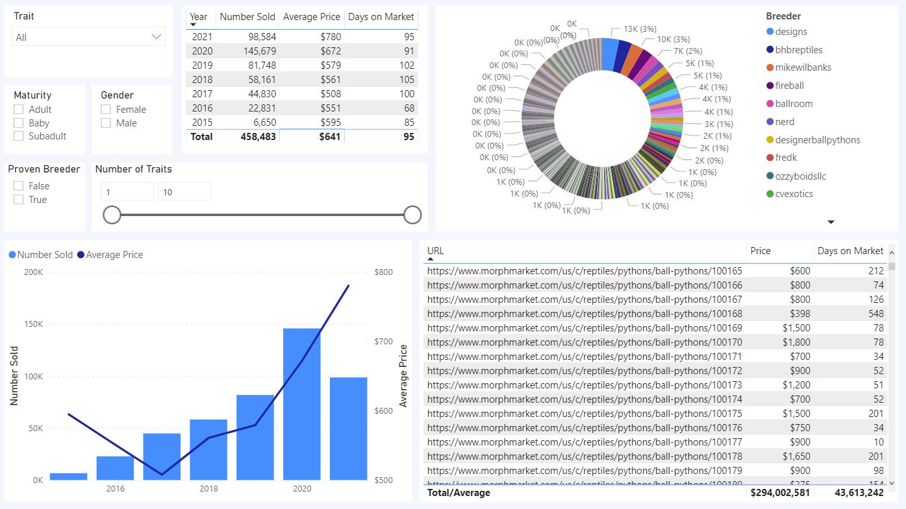
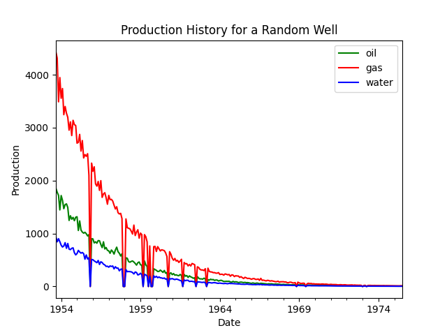

<p align="center">
  
</p>


---
---
 - 💪 Worked at multiple start-ups ranging from bootstrapped to Series B
 - ✅ [AWS Certified Solutions Architect -  Associate](awssa.pdf)
 - ⭐ 100% Job Success Score and only 5-star client reviews as contractor on [Upwork.com](https://www.upwork.com/freelancers/~01c133ff8ee4686b95)
 - 👷 Domain knowledge in Upstream Oil and Gas Operations

---
---

### [RE Data](https://github.com/re-data/re-data) - Open Source Maintainer & Top Contributor

<p>
  <a href="https://github.com/re-data/re-data"></a>
</p>


An open source data reliability framework for the modern data stack. RE Data is a DBT package, Python library and React UI. Adding the [RE Data DBT package](https://hub.getdbt.com/re-data/re_data/latest) to a DBT project will run out of the box data observability SQL queries in the background when `dbt run` is called. These queries calculate and store metrics like standard deviation, mean, row count, etc. The [RE Data Python library](https://pypi.org/project/re-data) can be called from the CLI to read in the stored metrics and create and serve [the RE Data UI](https://docs.getre.io/ui-latest/#/graph). RE Data is hosted across two GitHub repos. I am a top contributor to both and manage reviewing/merging PRs and creating releases.
- [Contributions re-data/re-data](https://github.com/re-data/re-data/commits?author=davidzajac1)
- [Contributions re-data/re-data-dbt](https://github.com/re-data/dbt-re-data/commits?author=davidzajac1)
- [Releases re-data/re-data](https://github.com/re-data/dbt-re-data/releases)
- [Releases re-data/re-data-dbt](https://github.com/re-data/re-data/releases)

<br />

```bash
$ pip install re_data
```

---
---

### [Zillacode.com](https://zillacode.com) - The ultimate resource to become a modern Data Engineer


<p>
  <a href="https://zillacode.com/ide/1"></a>
</p>

Created [Zillacode.com](Zillacode.com) a B2C SAAS platform used to help people study for coding interviews. It is the only online platform that runs live PySpark, Spark, DBT, Snowflake and Pandas code in the browser. Zillacode is proprietary, but feel free to reach out with requests to view the underlying code base. 

On the backend Zillacode is hosted using primarily the AWS Serverless stack, has automated UI testing and deployments across environments, automated recurring billing and Single Sign On from various providers. What make Zillacode difficult to reproduce and sets it apart from other coding interview prep platforms is the speed in which it runs Spark/PySpark and DBT code by repackaging them in clever ways so that they will run quickly in a browser.

---
---

<p>
  <a href="https://github.com/davidzajac1/iamscan"></a>
</p>


### [IAMScan](https://github.com/davidzajac1/iamscan) - CLI tool checks code for AWS IAM Privileges


[](https://github.com/psf/black)

IAMScan is an open source command line tool that reads your code and generates an AWS IAM policy with your needed permissions. Keeping track of AWS IAM permissions is annoying and time consuming. How often have you seen an update deployed to the cloud followed by `The provided execution role does not have permissions to call CreateSomething on SomeService`? IAMScan solves this issue by generating a perfectly [least privileged](https://docs.aws.amazon.com/IAM/latest/UserGuide/best-practices.html#grant-least-privilege) AWS IAM Policy for all Python Files, JavaScript Files and Shell Scripts from a single command line command.

IAMScan is [hosted on PyPI](https://pypi.org/project/iamscan/) and is installed using `pip`

<br />

```bash
$ pip install iamscan
```

---
---

<p>
  <a href="https://github.com/davidzajac1/Reptoro"></a>
</p>


### [Reptoro](https://github.com/davidzajac1/Reptoro) - A failed B2B SAAS Platform


Originally intended to be a paid analytics platform for exotic animal breeders, released as open source here due to lack of customer interest. Reptoro was a Dash/Flask App hosted on EC2 with graphs visualizing scraped industry data. On the backend it had an ETL pipeline architected using AWS Lambda, Athena, S3 and Apache Airflow to routinely webscrape online reptile marketplaces.

---
---

<p>
  <a href="https://github.com/davidzajac1/zoil"></a>
</p>


### [ZOil](https://github.com/davidzajac1/zoil) - Generate random Oil and Gas Data


ZOil is a python library used to generate random Oil and Gas data. Most Oil and Gas data is either proprietary or costly to acquire. ZOil lets you quickly generate an unlimited amount of production data that can be used to for testing, anonymization and much more. ZOil was inspired by the [`Faker`](https://github.com/joke2k/faker) library. 

ZOil is [hosted on PyPI](https://pypi.org/project/zoil/) and is installed using `pip`

<br />

```bash
$ pip install zoil
```
